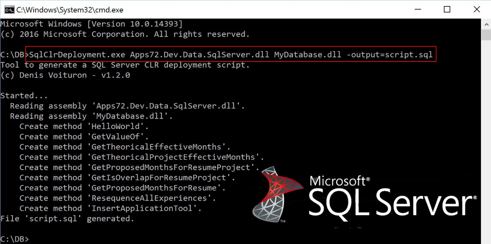

# SqlClrDeployment.exe
Command line to generate a SQL Server CLR deployment script (including serialized assemblies):

1. Reading one or multiple .NET Assemblies contains SQL Server CLR methods.
3. Generating a SQL Script to deploy all CLR methods in your SQL Server Database.

Download the last version here: [SqlClrDeployment.exe](https://github.com/Apps72/Dev.SqlClrDeployement/raw/master/releases/last/SqlClrDeployment.exe)

### Usage

```
SqlClrDeployement Assemblies [options...]
```

### Options:

Use at least -output or -connectionstring.

* **-output=[Filename]**  
SQL file name to generate.  
Ex: -output=Script.sql
                            
* **-connectionstring=["..."]**  
Connection string to execute immediately the SQL requests.  
Ex: -cs="Server=.;Database=MyDb;Trusted_Connection=True;"

* **-pre=[wildcards]**  
Filename or wildcards to find SQL files to execute before the CLR deployment.
These scripts will be executed in alphabetic order.  
Ex: -pre=C:\Scripts\before-*.sql

* **-post=[wildcards]**  
Filename or wildcards to find SQL files to execute after the CLR deployment.
These scripts will be executed in alphabetic order.  
Ex: -post=C:\Scripts\after-*.sql

* **-trustworthy=true|false**               
Set the TRUSTWORTHY database property to ON or OFF.  
Ex: -trustworthy=Yes

Sample:
```
SqlClrDeployement MyAssembly1.dll MyAssembly2.dll -output=Script.sql
```

```
SqlClrDeployement MyAssembly.dll -cs="Server=.;Database=MyDb;Trusted_Connection=True;" -pre=..\*.sql
```

